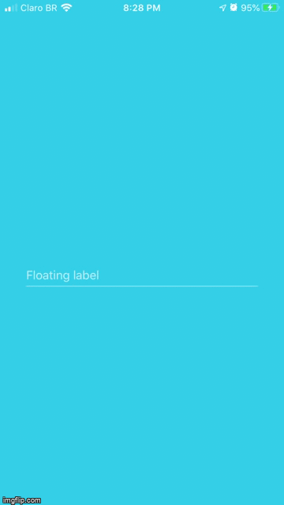

<h1 align="center">
    
    <br>
    Floating label
    <br>
    
    
    
    
</h1>

<div align="center">
    <h4 style="margin-bottom: 0;"> 🏁  Finished.  🏁</h4>
    <h5 style="margin-top: 0;">(for now)</h5>
</div>

<p align="center">React native input text with a floating label that slides up when focused, stays up when filled, and slide back down when empty without a focus.</p>

<p align="center">
 <a href="#-goal">Goal</a> •
 <a href="#-requirements">Requirements</a> • 
 <a href="#%EF%B8%8F-runing-project-%EF%B8%8F">Running project</a> • 
 <a href="#-technologies">Technologies</a> • 
 <a href="#%EF%B8%8F-author">Author</a>
</p>

## 🎯 Goal

<p align="center">Floating label input is a fully customizable component that has a label that can slide up so the user can type in. It can be adapted to work inside forms and however you want.
<br>
Enjoy!</p>

## 👨🏻‍🔬 Requirements

Before we begin, you'll need to have the following dependencies installed:
[Git](https://git-scm.com) and [Yarn](https://yarnpkg.com/).
Besides, it would be great that you have a code editor to work on this project, such as [VSCode](https://code.visualstudio.com/).

## 🏃‍♀️ Runing project 🏃‍♂️

```bash
#### Start sever ####

# Clone the repo
$ git clone <https://github.com/thalessarubbi/floating-label-input.git>

# Access project folder from a terminal
$ cd floating-label-input

# Install dependencies
$ yarn

# run mobile app on real device(you'll need to have an Expo client app installed in your device - <https://expo.io/tools#client>)
$ yarn start

# Your browser will open with an available QrCode.
# Scan the QrCode and the Expo client app will open with your project running

# run mobile app on iOS emulator(you'll need to be on a MacOS)
$ yarn start ios

# run mobile app on android emulator
$ yarn start android

# The mobile app will start in an emulator
```

## 🛠 Technologies

- [React Native](https://reactnative.dev/)
- [TypeScript](https://www.typescriptlang.org/)
- [Styled components](https://styled-components.com/)
- [Expo](https://expo.io/)
- [VS Code](https://code.visualstudio.com/)

## ✍️ Author
---
<br />

<br />
<sub><b>Thales Sarubbi</b></sub>


Made with 💙 by Thales Sarubbi 🗣 Let's talk!


[](https://www.linkedin.com/in/thales-sarubbi/) 
[](mailto:thalessarubbi@gmail.com)
